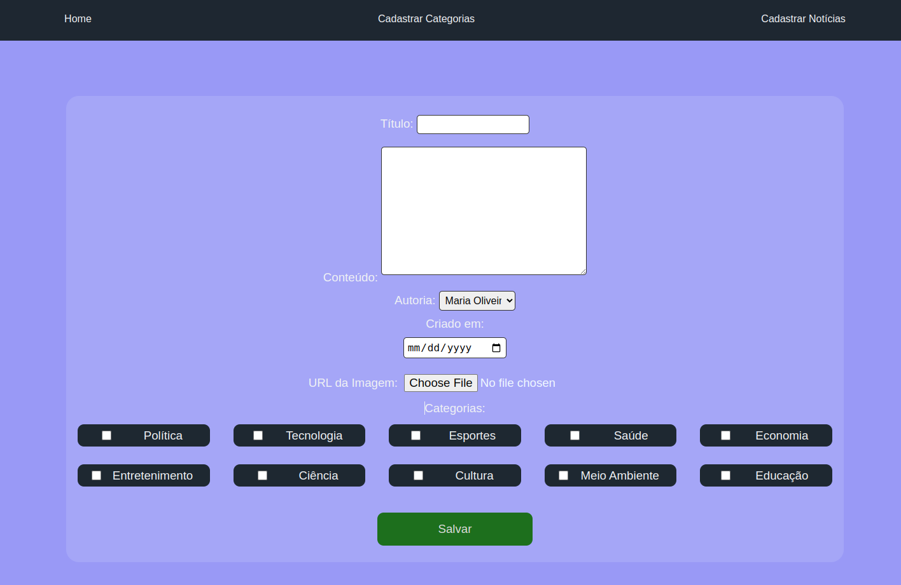

# README: Spotnews





## Project description

A news application where the admin user can add categories and news and other users can click on the card and check the details.


### Technologies

-   Python
-   Django
-   MySQL
-   Docker

### What I learned

- Write applications using Django and Django Rest Framework
- Develop an application that uses the Model-View-Template architecture
- Work with MYSQL database

## How to run the project

1. Clone the repository:

    ```bash
    git clone https://github.com/feduarte-dev/spotnews
    ```

2. Navigate to the project directory:

    ```bash
    cd your-repository
    ```

3. Create virtual enviroment:
    ```bash
    python3 -m venv .venv && source .venv/bin/activate
    ```
4. Install dependencies inside container:

    ```bash
    python3 -m pip install -r dev-requirements.txt
    ```

5. Initiate the containers:

    ```bash
    docker build -t spotnews-db .

    docker run -d -p 3306:3306 --name=spotnews-mysql-container -e MYSQL_ROOT_PASSWORD=password -e MYSQL_DATABASE=spotnews_database spotnews-db

    ```

6. Migrate and seed the database:

    ```bash
    python3 manage.py makemigrations
    python3 manage.py migrate
    python3 manage.py runscript seeds
    ```

7. Run server and access the URL:

    ```bash
    python3 manage.py runserver
    http://127.0.0.1:8000/
    ```